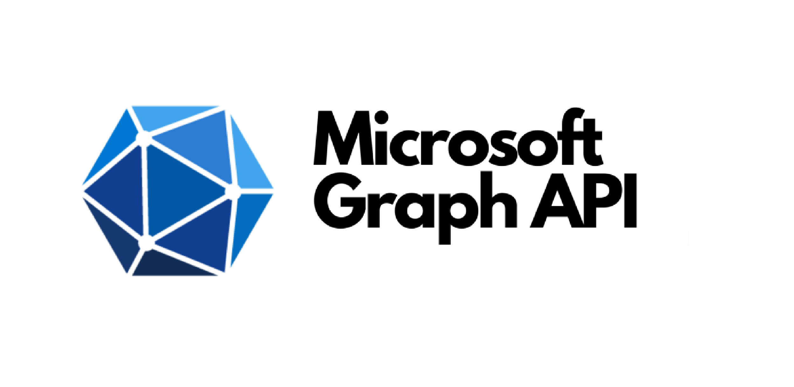
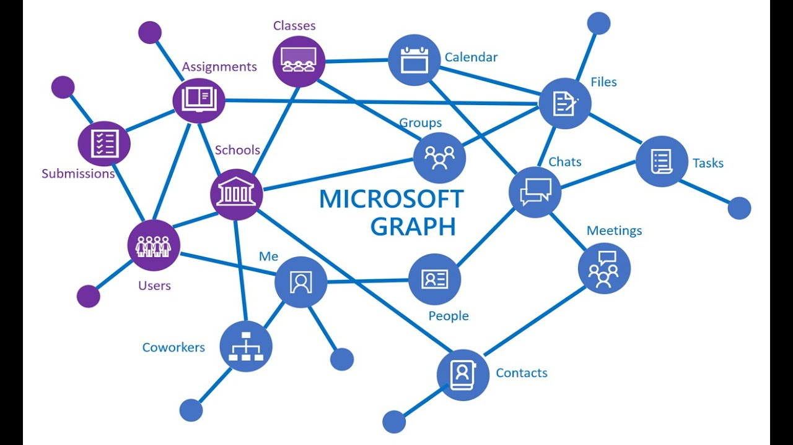

# microsoft-graph-mcp

<div align="center">
  
</div>

<h2 style="font-size: 1.5em; margin: 1em 0;">🚀 Microsoft Graph MCP Server</h2>

**Microsoft 365 integration for AI assistants** - Connect Cursor, Claude Desktop, and other MCP-compatible tools directly to Microsoft Graph. Access Outlook, OneDrive, Calendar, Teams, and automate workflows with AI.

[](https://www.npmjs.com/package/microsoft-graph-mcp)
[](https://opensource.org/licenses/MIT)
[](https://nodejs.org/)
[](https://www.typescriptlang.org/)
[](https://modelcontextprotocol.io/)
[](https://learn.microsoft.com/en-us/graph/overview)
[](https://github.com/easynet-world/7134-easy-mcp-server)

---

## ✅ What we provide (this project)

Deliverable | Description
--- | ---
AI-ready MCP server | Exposes Microsoft Graph capabilities as MCP tools for AI assistants
REST gateway for Microsoft Graph | Local HTTP API with OpenAPI/Swagger at `/docs`
Prebuilt Microsoft 365 endpoints | Users, Mail (send/reply/forward), Calendar (CRUD events), Files/OneDrive (list/upload/delete), Teams (teams/channels), Groups (members), Contacts, Tasks, Subscriptions (webhooks), Applications, Directory, Organization, People
Authentication via Azure AD | App Registration flow using `AZURE_CLIENT_ID`, `AZURE_CLIENT_SECRET`, `AZURE_TENANT_ID`
Production-ready scaffolding | Port/config management, error handling, health checks, API info, logging
Tested TypeScript implementation | Type-safe code with Jest tests covering all endpoints
Developer UX | Copy-pasteable `curl` examples, Swagger try-it-out, easy local run with `npx`
Security posture | Uses Application permissions; no data persisted by the server

---

## 📊 Microsoft Graph Overview



Microsoft Graph connects users, their activities, and content across Microsoft 365 services - Teams, Calendar, Files, Mail, People, Tasks, and more. This MCP server provides AI assistants with direct access to this unified data layer.

---

## 🚀 Quick Start

### Installation Methods

Method | Command | Best For
--- | --- | ---
**npx (Recommended)** | `npx microsoft-graph-mcp` | Quick testing, no installation needed
**npm global** | `npm install -g microsoft-graph-mcp` | Frequent use, system-wide access
**npm local** | `npm install microsoft-graph-mcp` | Project-specific integration
**Clone & build** | `git clone && npm install && npm run build` | Development and customization

### Run with npx (Recommended)

```bash
AZURE_CLIENT_ID=your-client-id \
AZURE_CLIENT_SECRET=your-client-secret \
AZURE_TENANT_ID=your-tenant-id \
npx microsoft-graph-mcp
```

**That's it!** The server runs on:

Service | URL | Notes
--- | --- | ---
REST API | http://localhost:8887 | Base URL for all endpoints
API Docs (Swagger) | http://localhost:8887/docs | Interactive documentation
MCP Server | http://localhost:8888 | Model Context Protocol server

### Run with .env file

Create a `.env` file:

```bash
AZURE_CLIENT_ID=your-client-id
AZURE_CLIENT_SECRET=your-client-secret
AZURE_TENANT_ID=your-tenant-id
```

Then run:
```bash
npx microsoft-graph-mcp
```

---

## 📋 Azure Configuration

### Configuration Steps Overview

Step | Action | Where to Find | Environment Variable
--- | --- | --- | ---
1 | Create App Registration | [Azure Portal](https://portal.azure.com) → Azure AD → App registrations | -
2 | Copy Application (client) ID | App registration → Overview | `AZURE_CLIENT_ID`
3 | Copy Directory (tenant) ID | App registration → Overview | `AZURE_TENANT_ID`
4 | Create client secret | App registration → Certificates & secrets | `AZURE_CLIENT_SECRET`
5 | Add API permissions | App registration → API permissions | -
6 | **Grant admin consent** | API permissions → Grant admin consent | -

### Step 1: Create Azure App Registration

1. Go to [Azure Portal](https://portal.azure.com)
2. Navigate to **Azure Active Directory** > **App registrations**
3. Click **New registration**
4. Fill in:
   - **Name**: Microsoft Graph MCP Server
   - **Supported account types**: Accounts in this organizational directory only (or Multi-tenant)
   - Click **Register**

### Step 2: Get Credentials

1. **Application (client) ID** → Copy this as `AZURE_CLIENT_ID`
2. **Directory (tenant) ID** → Copy this as `AZURE_TENANT_ID`
3. Go to **Certificates & secrets** → **New client secret**
   - Copy the **secret value** as `AZURE_CLIENT_SECRET` (only shown once!)

### Step 3: Add Application Permissions

1. Go to **API permissions** → **Add a permission** → **Microsoft Graph** → **Application permissions**
2. Add these permissions:

   Permission | Type | Description
   --- | --- | ---
   `User.Read.All` | Application | Read all users
   `Mail.Read` | Application | Read mail in all mailboxes
   `Mail.Send` | Application | Send mail as any user
   `Calendars.Read` | Application | Read calendars in all mailboxes
   `Files.Read.All` | Application | Read all files
   `Group.Read.All` | Application | Read all groups
   `Contacts.Read` | Application | Read contacts
   `Tasks.ReadWrite.All` | Application | Read and write tasks
   `Organization.Read.All` | Application | Read organization information
   `People.Read.All` | Application | Read people profiles
   `Application.Read.All` | Application | Read applications
   `Subscription.Read.All` | Application | Manage subscriptions

3. **⚠️ CRITICAL:** Click **Grant admin consent for [your organization]**

---

## 💻 Use in Cursor / Claude Desktop

### MCP Client Configuration Overview

Client | Config Location | How to Access
--- | --- | ---
**Cursor** | Cursor Settings | Settings → Features → Model Context Protocol → Edit Config
**Claude Desktop (Mac)** | File system | `~/Library/Application Support/Claude/claude_desktop_config.json`
**Claude Desktop (Windows)** | File system | `%APPDATA%\Claude\claude_desktop_config.json`
**Claude Desktop (Linux)** | File system | `~/.config/Claude/claude_desktop_config.json`

### Configuration Steps

#### For Cursor

1. Open **Cursor Settings** → **Features** → **Model Context Protocol**
2. Click **"Edit Config"**
3. Add the configuration below
4. Save and restart Cursor

#### For Claude Desktop

1. Locate and open the config file (see table above)
2. Add the configuration below
3. Save the file
4. Restart Claude Desktop

### Configuration JSON (All Clients)

```json
{
  "mcpServers": {
    "microsoft-graph-mcp": {
      "command": "npx",
      "args": ["-y", "microsoft-graph-mcp"],
      "env": {
        "AZURE_CLIENT_ID": "your-client-id",
        "AZURE_CLIENT_SECRET": "your-client-secret",
        "AZURE_TENANT_ID": "your-tenant-id"
      }
    }
  }
}
```

**Note:** Replace `your-client-id`, `your-client-secret`, and `your-tenant-id` with your actual Azure credentials.

---

## 📡 Using the REST API

Once the server is running, you have full access to Microsoft Graph via REST endpoints.

### 🔍 Interactive API Documentation

**Swagger UI** (Recommended - Visual Interface):
```
http://localhost:8887/docs
```
- Browse all endpoints
- Try requests directly in the browser
- See request/response schemas

**OpenAPI JSON**:
```
http://localhost:8887/openapi.json
```
- Import into Postman, Insomnia, or any OpenAPI-compatible tool

### 📝 Common API Examples

Operation | Method | Endpoint | Example
--- | --- | --- | ---
**List Users** | GET | `/graph/users` | `curl "http://localhost:8887/graph/users?$top=10"`
**Get Email** | GET | `/graph/mail` | `curl "http://localhost:8887/graph/mail?userId=user@domain.com&$top=10"`
**Send Email** | POST | `/graph/mail` | See detailed example below
**Get Calendar** | GET | `/graph/calendar` | `curl "http://localhost:8887/graph/calendar?userId=user@domain.com&$top=10"`
**Create Event** | POST | `/graph/calendar/events` | See detailed example below
**List Files** | GET | `/graph/files` | `curl "http://localhost:8887/graph/files?userId=user@domain.com&$top=20"`
**Get Teams** | GET | `/graph/teams` | `curl http://localhost:8887/graph/teams`

#### Detailed Examples

**Send an Email:**
```bash
curl -X POST http://localhost:8887/graph/mail \
  -H "Content-Type: application/json" \
  -d '{
    "toRecipients": [{"emailAddress": {"address": "user@example.com"}}],
    "subject": "Hello from microsoft-graph-mcp!",
    "body": {"contentType": "text", "content": "This is a test message"}
  }'
```

**Create Calendar Event:**
```bash
curl -X POST http://localhost:8887/graph/calendar/events \
  -H "Content-Type: application/json" \
  -d '{
    "subject": "Team Meeting",
    "start": {"dateTime": "2024-01-15T10:00:00", "timeZone": "UTC"},
    "end": {"dateTime": "2024-01-15T11:00:00", "timeZone": "UTC"},
    "userId": "user@domain.com"
  }'
```

---

## 📚 All Available Endpoints

### Users (6 endpoints)

Method | Path | Description
--- | --- | ---
GET | `/graph/users` | Get list of users (supports filtering, pagination)
GET | `/graph/users/:userId` | Get specific user by ID
POST | `/graph/users` | Create new user
PATCH | `/graph/users/:userId` | Update user
DELETE | `/graph/users/:userId` | Delete user
GET | `/graph/users/:userId/photo` | Get user photo

### Mail (7 endpoints)

Method | Path | Description
--- | --- | ---
GET | `/graph/mail?userId=user@domain.com` | Get email messages (supports filtering)
GET | `/graph/mail/:messageId?userId=user@domain.com` | Get specific message
POST | `/graph/mail` | Send email message
POST | `/graph/mail/:messageId/reply?userId=user@domain.com` | Reply to message
POST | `/graph/mail/:messageId/forward?userId=user@domain.com` | Forward message
DELETE | `/graph/mail/:messageId?userId=user@domain.com` | Delete message
GET | `/graph/mail/folders?userId=user@domain.com` | Get mail folders

### Calendar (5 endpoints)

Method | Path | Description
--- | --- | ---
GET | `/graph/calendar?userId=user@domain.com` | Get calendar events (supports filtering)
GET | `/graph/calendars?userId=user@domain.com` | Get user calendars
POST | `/graph/calendar/events` | Create calendar event (include userId in body)
PATCH | `/graph/calendar/events/:eventId?userId=user@domain.com` | Update calendar event
DELETE | `/graph/calendar/events/:eventId?userId=user@domain.com` | Delete calendar event

### Files/OneDrive (4 endpoints)

Method | Path | Description
--- | --- | ---
GET | `/graph/files?userId=user@domain.com` | Get files and folders from OneDrive
GET | `/graph/drives?userId=user@domain.com` | Get drives (OneDrive and SharePoint)
POST | `/graph/files/upload` | Upload file to OneDrive (include userId in body)
DELETE | `/graph/files/:itemId?userId=user@domain.com` | Delete file or folder

### Groups (3 endpoints)

Method | Path | Description
--- | --- | ---
GET | `/graph/groups` | Get list of groups
POST | `/graph/groups` | Create new group
GET | `/graph/groups/:groupId/members` | Get group members

### Teams (2 endpoints)

Method | Path | Description
--- | --- | ---
GET | `/graph/teams` | Get list of teams
GET | `/graph/teams/:teamId/channels` | Get team channels

### Contacts (2 endpoints)

Method | Path | Description
--- | --- | ---
GET | `/graph/contacts?userId=user@domain.com` | Get contacts
POST | `/graph/contacts` | Create contact (include userId in body)

### Tasks (2 endpoints)

Method | Path | Description
--- | --- | ---
GET | `/graph/tasks?userId=user@domain.com` | Get tasks/to-do items
POST | `/graph/tasks` | Create task (include userId in body)

### Additional Services

Method | Path | Description
--- | --- | ---
GET | `/graph/applications` | Get applications
GET | `/graph/directory` | Get directory objects
GET | `/graph/organization` | Get organization information
GET | `/graph/people?userId=user@domain.com` | Get people (colleagues and contacts)
GET | `/graph/subscriptions` | Get webhook subscriptions
POST | `/graph/subscriptions` | Create webhook subscription

### System

Method | Path | Description
--- | --- | ---
GET | `/health` | Health check
GET | `/api-info` | API information
GET | `/openapi.json` | OpenAPI specification
GET | `/docs` | Swagger UI documentation

**All endpoints are automatically exposed as MCP tools for AI agents to use.**

---

## ⚙️ Advanced Configuration

### Environment Variables

Variable | Required | Default | Description
--- | --- | --- | ---
`AZURE_CLIENT_ID` | Yes | - | Azure AD application (client) ID
`AZURE_CLIENT_SECRET` | Yes | - | Azure AD client secret (value)
`AZURE_TENANT_ID` | Yes | - | Azure AD directory (tenant) ID
`AZURE_SCOPE` | No | `https://graph.microsoft.com/.default` | Microsoft Graph scope
`EASY_MCP_SERVER_PORT` | No | `8887` | REST API port
`EASY_MCP_SERVER_MCP_PORT` | No | `8888` | MCP server port
`EASY_MCP_SERVER_LOG_LEVEL` | No | `info` | Logging level

---

## 🎯 Use Cases

### By User Type

User Type | Use Case | Example Query/Action
--- | --- | ---
**AI Assistant Users** | Email management | "Get my latest emails from Outlook"
| | Calendar scheduling | "Create a calendar event for tomorrow at 2pm"
| | File management | "Show me files in my OneDrive"
| | Team collaboration | "List all Microsoft Teams in the organization"
| | Communication | "Send an email to john@example.com about the project update"
| | Contact lookup | "What contacts do I have?"
**Developers** | Custom integrations | Build Microsoft 365 workflow automations
| | API testing | Test Microsoft Graph endpoints via Swagger UI
| | Application development | Create custom M365 applications
| | Service integration | Connect M365 with third-party services
**IT Administrators** | User management | List and manage users via REST API
| | Audit and monitoring | Track email, calendar, and file activities
| | Provisioning | Automate user and group creation
| | Reporting | Generate usage reports across M365 services

### By Interface

Interface | Best For | Access Point
--- | --- | ---
**MCP (AI Agents)** | Natural language queries, AI-powered workflows | Cursor, Claude Desktop, MCP-compatible tools
**REST API** | Programmatic access, automation scripts | http://localhost:8887/graph/*
**Swagger UI** | Visual exploration, testing, documentation | http://localhost:8887/docs

---

## 🔧 Troubleshooting

Issue | Possible Cause | Solution
--- | --- | ---
**Server won't start** | Port already in use | Check that port 8887/8888 is not in use: `lsof -i :8887`
| | Invalid credentials | Verify Azure credentials are correct in `.env`
| | Wrong Node.js version | Ensure Node.js >= 22.0.0 is installed: `node --version`
**Authentication errors** | Invalid credentials | Verify `AZURE_CLIENT_ID`, `AZURE_CLIENT_SECRET`, and `AZURE_TENANT_ID` are correct
| | Expired client secret | Create a new client secret in Azure Portal
| | Missing admin consent | Click "Grant admin consent" in Azure Portal → API permissions
| | Wrong permission type | Ensure permissions are "Application permissions" (not Delegated)
**"Insufficient privileges"** | Missing permissions | Verify all required permissions are added in Azure Portal
| | Admin consent not granted | Grant admin consent in Azure Portal → API permissions
| | Delegated vs Application | Check that permissions are Application permissions (not Delegated)
**MCP not working** | Config not loaded | Restart Cursor/Claude after adding MCP config
| | Server not running | Check server is running: `curl http://localhost:8887/health`
| | Wrong environment variables | Verify environment variables in MCP config are correct
| | MCP connection failed | Check Cursor/Claude logs for MCP errors
**API calls fail** | Authentication issue | Test authentication: `curl http://localhost:8887/graph/users/me`
| | Endpoint not found | Check Swagger UI: http://localhost:8887/docs
| | Missing permissions | Verify Azure app has required permissions
| | Server error | Review server logs for detailed error messages
**Rate limiting** | Too many requests | Implement exponential backoff, reduce request frequency
**Timeout errors** | Slow network/API | Increase timeout settings, check network connection

---

## 📖 Learn More

### Documentation & Resources

Resource | Description | Link
--- | --- | ---
**Microsoft Graph API** | Official Microsoft Graph documentation and API reference | [learn.microsoft.com/graph](https://learn.microsoft.com/en-us/graph/overview)
**Model Context Protocol** | MCP specification and implementation guides | [modelcontextprotocol.io](https://modelcontextprotocol.io/)
**Azure App Registration** | Guide to creating and configuring Azure AD apps | [learn.microsoft.com/azure](https://learn.microsoft.com/en-us/azure/active-directory/develop/quickstart-register-app)
**Graph API Permissions** | Complete list of Microsoft Graph permissions | [learn.microsoft.com/permissions](https://learn.microsoft.com/en-us/graph/permissions-reference)
**easy-mcp-server** | Framework documentation for customization | [github.com/easynet-world](https://github.com/easynet-world/7134-easy-mcp-server)

---

## 📦 Package Info

Resource | Link
--- | ---
**npm Package** | [microsoft-graph-mcp](https://www.npmjs.com/package/microsoft-graph-mcp)
**GitHub Repository** | [7160-microsoft-graph-mcp](https://github.com/easynet-world/7160-microsoft-graph-mcp)
**Issue Tracker** | [GitHub Issues](https://github.com/easynet-world/7160-microsoft-graph-mcp/issues)
**License** | MIT
**Support** | info@easynet.world

---

## 🆘 Need Help?

### Quick Diagnostic Checklist

Step | Check | Command/Action
--- | --- | ---
1 | **Swagger UI** | Open http://localhost:8887/docs
2 | **Server Health** | `curl http://localhost:8887/health`
3 | **Authentication** | `curl http://localhost:8887/graph/users/me`
4 | **Azure Config** | Review [Azure Configuration](#-azure-configuration) section
5 | **Troubleshooting** | Check [Troubleshooting](#-troubleshooting) table above
6 | **Enterprise Support** | Contact: info@easynet.world

---

## 🛠️ Development

This MCP server is built using the **easy-mcp-server** framework.

### Development Resources

Topic | Description | Link
--- | --- | ---
**Custom Endpoints** | How to create custom API endpoints | [easy-mcp-server docs](https://github.com/easynet-world/7134-easy-mcp-server)
**Project Structure** | Architecture and code organization | [easy-mcp-server docs](https://github.com/easynet-world/7134-easy-mcp-server)
**Testing & Debugging** | Test setup and debugging tips | [easy-mcp-server docs](https://github.com/easynet-world/7134-easy-mcp-server)
**Contributing** | Guidelines for contributions | [easy-mcp-server docs](https://github.com/easynet-world/7134-easy-mcp-server)
**TypeScript** | Type definitions and compilation | See `tsconfig.json` and `lib/` directory

### Local Development Setup

Step | Command | Purpose
--- | --- | ---
1. **Clone** | `git clone https://github.com/easynet-world/7160-microsoft-graph-mcp.git` | Get source code
2. **Install** | `npm install` | Install dependencies
3. **Configure** | Copy `.env.example` to `.env` | Set environment variables
4. **Build** | `npm run build` | Compile TypeScript
5. **Test** | `npm test` | Run test suite
6. **Start** | `npm start` | Start development server

---

**Powered by [easy-mcp-server](https://github.com/easynet-world/7134-easy-mcp-server) framework**
